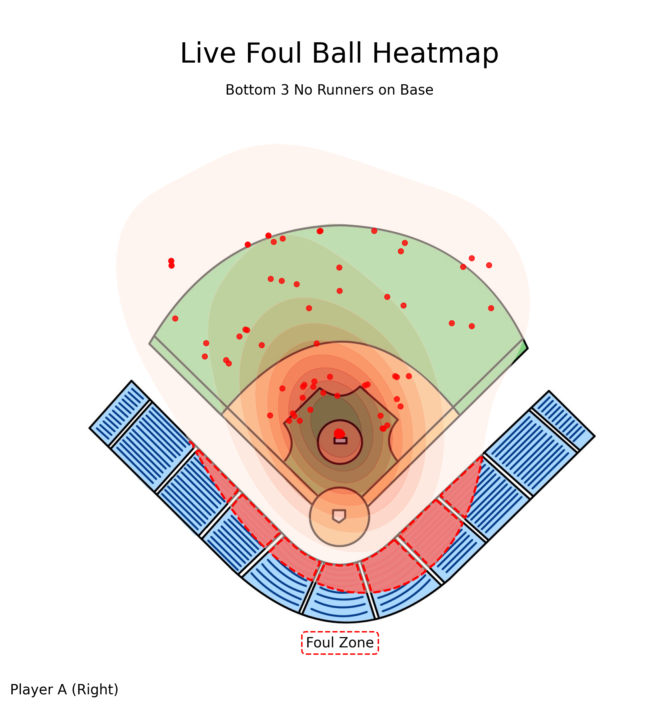
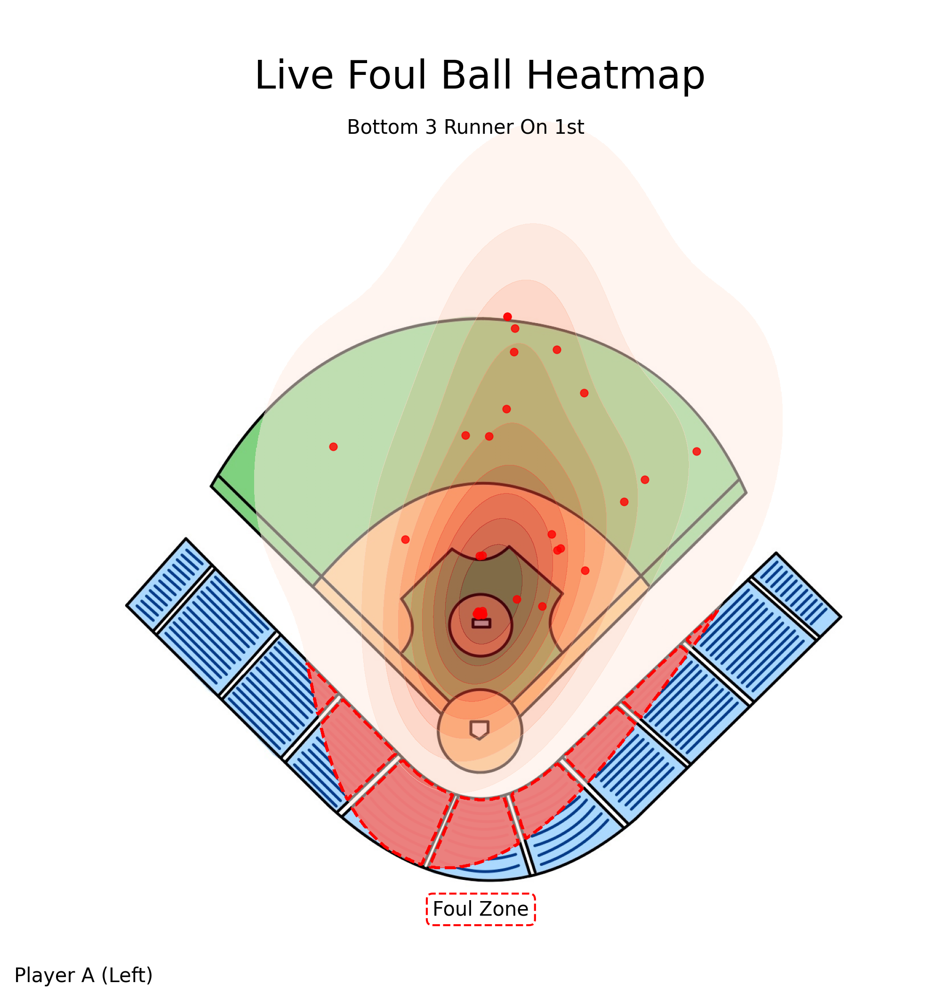
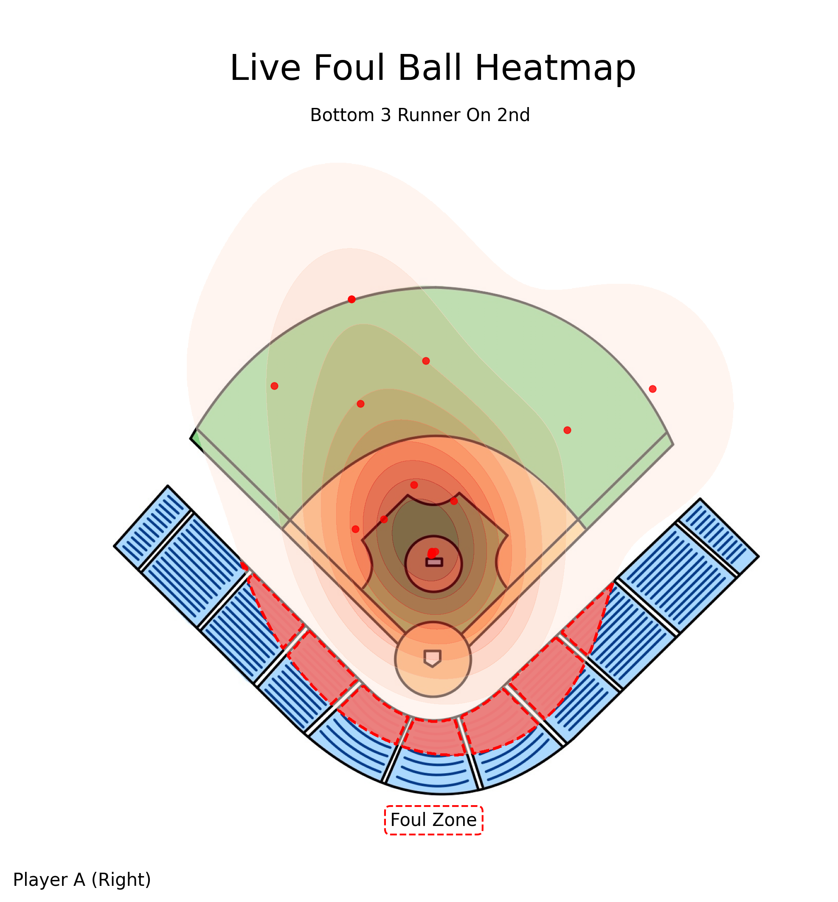
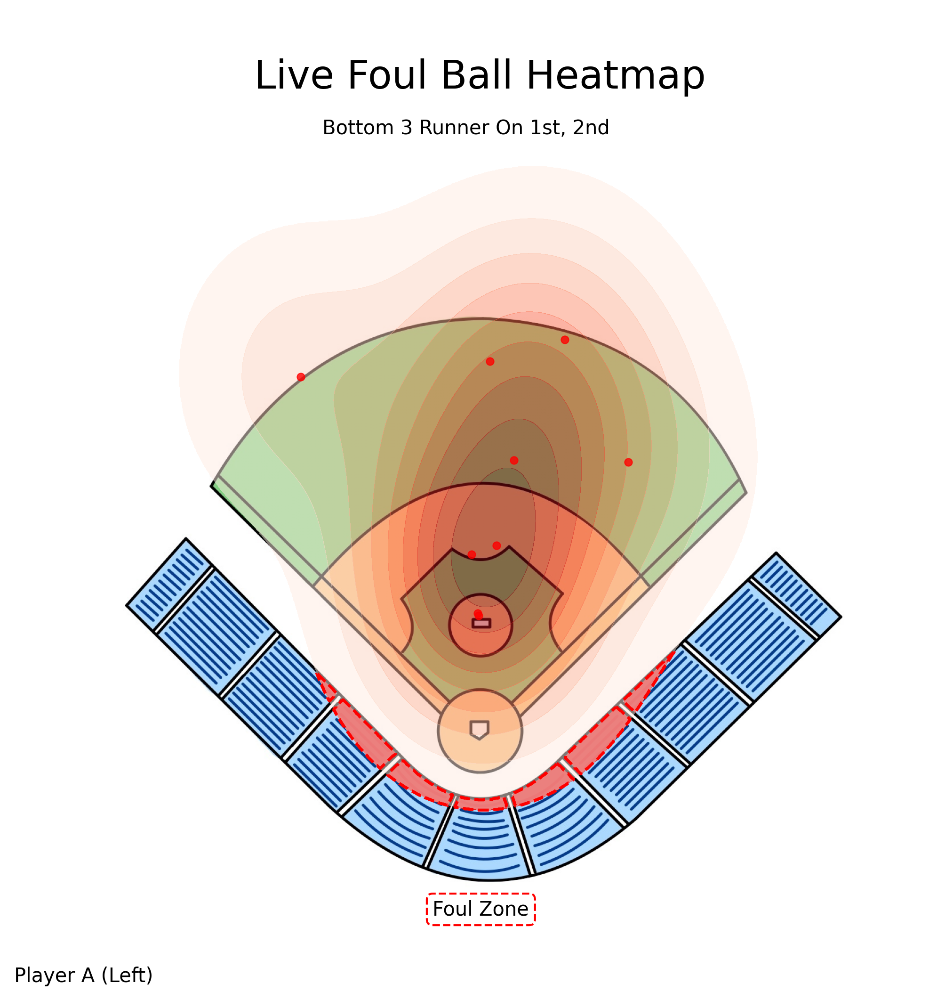

# Dynamic Foul Ball Heatmaps

This repository provides the code used to generate foul ball heatmaps that dynamically update based on game situations and batter handedness using player and ball tracking data for the SMT Data Challenge 2026. Since the data is proprietary, the code cannot be run without access to the original dataset.

## Project Content
```
Team-104-Analysis-Code/                        
├── src/
│   ├── dataCollection.py        # Functions for Data Collection and Processing
│   └── heatmapGeneration.py     # Functions for Heatmap Generation and Visualization
├── field.img                    # Background Image of Baseball Field
├── pipeline.ipynb               # Jupyter Notebook for Running Pipeline 
├── requirements.txt 
└── README.md
```

## Results 
Below, are some example heatmaps that were generated using this respository. 

<p align="center">
  
  
</p>

<p align="center">
  
  
</p>